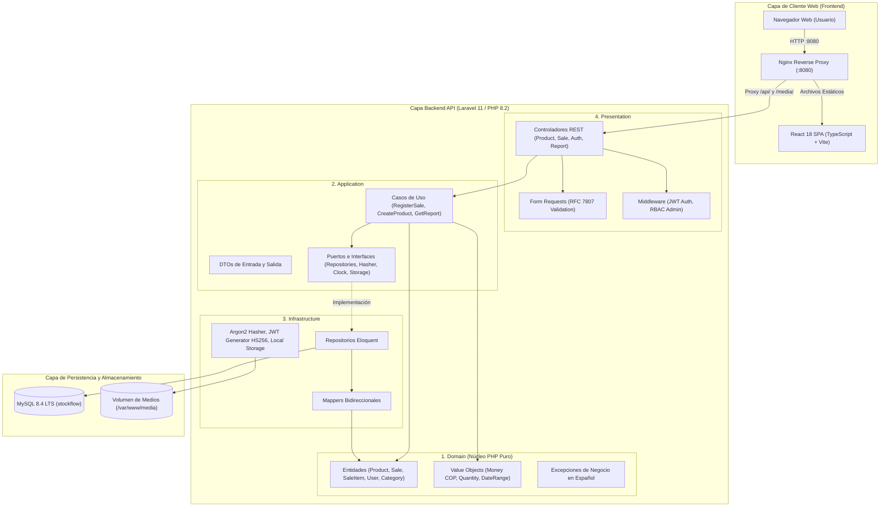
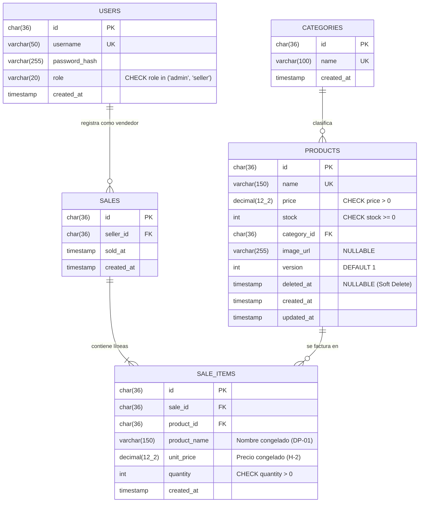
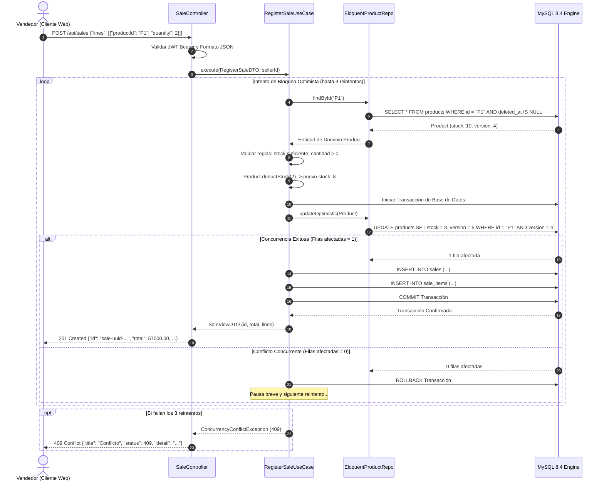

# Simple Stock Flow · Documentación Técnica y Manual de Entrega

> **Prueba Técnica de Desempeño SDD (Spec-Driven Development)**  
> **Servicio Nacional de Aprendizaje (SENA) · Análisis y Desarrollo de Software (ADSO)**  
> **Ficha:** 3413974  
> **Desarrollador / Candidato:** Kevin (GitHub: [`Kevin81A`](https://github.com/Kevin81A))  
> **Stack Implementado:** PHP 8.2 (Laravel 11) + React 18 (Vite + TypeScript) + MySQL 8.4 LTS + Docker Compose  

---

## 1. Resumen Ejecutivo y Metodología SDD

La prueba técnica *Simple Stock Flow* evalúa la competencia en **Spec-Driven Development (SDD)**: la capacidad de tomar una especificación técnica rigurosa (expresada conceptualmente en Python y .NET), interpretarla críticamente sin sesgos ni suposiciones, y materializarla en un stack de producción distinto (**PHP con Laravel** en el backend y **React con TypeScript** en el frontend).

### Principios Fundamentales Observados
1. **El código es el medio, la especificación es la ley:** Se respetaron todas las reglas de negocio (RN-01 a RN-11), decisiones de producto (DP-01 a DP-04), invariantes monetarias y temporales, y el contrato OpenAPI / RFC 7807.
2. **Dominio Puro (Arquitectura Onion / Hexagonal):** La capa de Dominio en PHP está 100% aislada de dependencias de frameworks (cero Eloquent, cero Laravel).
3. **Persistencia Rigurosa en Motor Relacional:** Modelo en MySQL 8.4 LTS con 25 columnas exactas, 21 restricciones de integridad, 13 índices y 9 checks de motor (ADR-001).
4. **Ecosistema Modular de 6 Repositorios:** Repositorios clonados como hermanos con separación clara de responsabilidades.

---

## 2. Diagramas de Arquitectura y Flujos

### 2.1. Arquitectura Global de la Solución (Onion / Hexagonal)



---

### 2.2. Modelo Entidad-Relación de la Base de Datos



---

### 2.3. Diagrama de Secuencia: Venta Transaccional con Bloqueo Optimista (RN-11)



---

## 3. Matriz de Trazabilidad: Reglas de Negocio y Decisiones

| Código | Descripción de la Regla / Decisión | Archivo de Implementación | Comportamiento Verificado |
|---|---|---|---|
| **RN-01** | Nombre de producto único y no vacío (máx 150 caracteres). | `app/Domain/Entities/Product.php` y `CreateProductRequest.php` | Validación en Request (400) y constraint UNIQUE en base de datos. |
| **RN-02** | Precio de producto mayor a cero, en COP con 2 decimales. | `app/Domain/ValueObjects/Money.php` | Redondeo `ROUND_HALF_UP`, validación `price > 0`. |
| **RN-03** | Stock mayor o igual a cero (entero no negativo). | `app/Domain/ValueObjects/Quantity.php` | `CHECK stock >= 0` en base de datos; excepción si es negativo. |
| **RN-04** | Producto debe pertenecer a una categoría válida existente. | `app/Domain/Entities/Category.php` y `EloquentProductRepository.php` | Clave foránea `category_id` hacia tabla `categories`. |
| **RN-05** | Imagen de producto opcional, máx 5 MB, JPEG/PNG/WebP. | `app/Presentation/Requests/UploadImageRequest.php` | Validación de tamaño y tipo MIME real; subida a `/media/`. |
| **RN-06** | Soft Delete: productos con ventas no se eliminan físicamente. | `app/Application/UseCases/SoftDeleteProductUseCase.php` | `deleted_at` timestamp; se oculta en catálogo, pero persiste en historial. |
| **RN-07** | Venta no puede estar vacía; cantidad por ítem > 0. | `app/Domain/Entities/Sale.php` | `EmptySaleException` si no hay líneas; `InvalidQuantityException`. |
| **RN-08** | No permitir productos duplicados en una misma venta. | `app/Domain/Entities/Sale.php` | `DuplicateSaleProductException` (400) si se repite `productId`. |
| **RN-09** | Deducción atómica de stock con verificación previa. | `app/Application/UseCases/RegisterSaleUseCase.php` | Si no hay stock suficiente, lanza `InsufficientStockException` (422). |
| **RN-10** | Valores derivados (`subtotal`, `total`) calculados al vuelo. | `app/Domain/Entities/Sale.php` y `SaleItem.php` | No existen columnas `subtotal` ni `total` en BD (Artículo VII). |
| **RN-11** | Manejo de concurrencia y conflicto en stock simultáneo. | `app/Application/UseCases/RegisterSaleUseCase.php` | Bloqueo optimista con versión y 3 reintentos. Retorna 409 en conflicto. |
| **DP-01** | Reportes deben conservar el nombre histórico congelado. | `app/Infrastructure/Persistence/Repositories/DatabaseSalesReportQuery.php` | Subconsulta SQL particionada por producto en el rango `from`/`to`. |
| **DP-02** | Rango de fechas con límite superior exclusivo (`to` exclusive). | `app/Domain/ValueObjects/DateRange.php` | Condición SQL `sold_at >= :from AND sold_at < :to`. |
| **DP-03** | Paginación por defecto de 20 elementos (máximo 100). | `app/Application/UseCases/GetProductCatalogUseCase.php` | Paginación estándar con DTO `PagedResultDTO`. |
| **DP-04** | Los administradores no pueden crear otros administradores. | `app/Application/UseCases/RegisterSellerUseCase.php` | Endpoint `/api/auth/register` fuerza inmutablemente `role = 'seller'`. |

---

## 4. Conformidad con la Constitución SDD (13 Artículos)

* **Artículo I (Dominio sin Framework):** `app/Domain/` contiene únicamente clases PHP nativas, sin `extends Model`, sin anotaciones y sin librerías externas.
* **Artículo II (Nombres de dominio independientes de la persistencia):** Entidades y campos modelan conceptos de negocio (`name`, `price`, `stock`).
* **Artículo III (Inmutabilidad de Value Objects):** `Money`, `Quantity` y `DateRange` son clases `readonly` que retornan nuevas instancias al operar.
* **Artículo IV (Transacciones atómicas en Casos de Uso):** Se utiliza `UnitOfWorkInterface` respaldado por `DB::transaction()` de Laravel en `DatabaseUnitOfWork`.
* **Artículo V & ADR-001 (Dueño del Esquema):** El motor MySQL arranca vacío; las migraciones de la API son la única fuente de verdad DDL.
* **Artículo VI (Sin lógica de negocio en controladores ni vistas):** Los controladores únicamente mapean HTTP a DTOs y llaman a los casos de uso.
* **Artículo VII (Cero columnas derivadas):** Ni `sales` ni `sale_items` tienen campos calculados persistidos.
* **Artículo VIII (Seguridad RBAC y JWT):** Implementación sin estados basada en tokens simétricos HS256 con claims `sub` y `role`.
* **Artículo IX (Cero secretos por defecto):** El código falla o requiere variables de entorno en producción para `JWT_SIGNING_KEY` y `ADMIN_PASSWORD`.
* **Artículo X (Validación estricta en el borde):** Form Requests validan payloads y retornan respuestas con formato normalizado `application/problem+json` (RFC 7807).
* **Artículo XI (Regla de los Dos Idiomas):** Código fuente, variables, nombres de bases de datos y pruebas en **Inglés**; mensajes de error para usuarios, respuestas de validación e interfaces visuales en **Español** con acentos y puntuación formal.
* **Artículo XII (Idempotencia en herramientas de utilidad):** `ssf_tool` puede ejecutarse $N$ veces sin duplicar datos ni romper restricciones.
* **Artículo XIII (Documentación completa con 5 preguntas):** Cada uno de los repositorios posee un `README.md` que responde detalladamente las 5 preguntas requeridas.

---

## 5. Catálogo de Endpoints REST Implementados

Todos los endpoints respetan el contrato de respuesta y códigos de estado:

| Método | Endpoint | Autenticación / Rol | Códigos HTTP Retornados | Descripción |
|---|---|---|---|---|
| `GET` | `/health` | Público | `200` | Sonda de salud que responde `{"status":"ok"}`. |
| `POST` | `/api/auth/login` | Público | `200`, `400`, `401 (vacío)` | Inicio de sesión; retorna `accessToken`, `role`, `username`. |
| `POST` | `/api/auth/register` | `admin` | `201`, `400`, `401 (vacío)`, `403 (vacío)` | Registro de nuevo vendedor (fuerza rol `seller` DP-04). |
| `GET` | `/api/categories` | Autenticado | `200`, `401 (vacío)` | Listado de las 5 categorías semilla fijas. |
| `GET` | `/api/products` | Autenticado | `200`, `400`, `401 (vacío)` | Catálogo paginado con filtros (`search`, `categoryId`). |
| `GET` | `/api/products/{id}` | Autenticado | `200`, `401 (vacío)`, `404 (vacío)` | Detalle de un producto por su UUID. |
| `POST` | `/api/products` | `admin` | `201`, `400`, `401 (vacío)`, `403 (vacío)` | Creación de nuevo producto en el catálogo. |
| `PUT` | `/api/products/{id}` | `admin` | `200`, `400`, `401 (vacío)`, `403 (vacío)`, `404 (vacío)` | Actualización de datos de un producto existente. |
| `DELETE` | `/api/products/{id}` | `admin` | `204`, `401 (vacío)`, `403 (vacío)`, `404 (vacío)` | Eliminación lógica (Soft Delete). |
| `POST` | `/api/products/{id}/image`| `admin` | `200`, `400`, `401 (vacío)`, `403 (vacío)` | Subida de imagen (máx 5 MB, multipart/form-data). |
| `GET` | `/media/{key}` | Público | `200`, `404 (vacío)` | Descarga directa de archivos de imagen persistidos. |
| `POST` | `/api/sales` | Autenticado | `201`, `400`, `401 (vacío)`, `409`, `422` | Registro atómico de venta con deducción de stock. |
| `GET` | `/api/sales` | Autenticado | `200`, `400`, `401 (vacío)` | Historial paginado filtrado por rango `from`/`to`. |
| `GET` | `/api/sales/{id}` | Autenticado | `200`, `401 (vacío)`, `404 (vacío)` | Comprobante detallado con líneas y nombres congelados. |
| `GET` | `/api/reports/sales` | Autenticado | `200`, `400`, `401 (vacío)` | Reporte consolidado con métricas y desglose de productos. |

---

## 6. Guía de Despliegue y Evaluación Paso a Paso

### 6.1. Requisitos Previos
- **Docker Desktop** (con Docker Compose v2+) instalado y en ejecución en el sistema.
- Los 6 repositorios clonados como hermanos en una misma carpeta:
  ```
  parent_folder/
  ├── test-simple-stock-flow-api/
  ├── test-simple-stock-flow-app/
  ├── test-simple-stock-flow-docs/
  ├── test-simple-stock-flow-infra/
  ├── test-simple-stock-flow-page/
  └── test-simple-stock-flow-tool/
  ```

### 6.2. Levantamiento del Entorno Completo
```bash
# 1. Ingresar al repositorio de infraestructura
cd test-simple-stock-flow-infra

# 2. Levantar los contenedores en segundo plano
docker compose up -d --build

# 3. Comprobar que los servicios estén sanos (healthy)
docker compose ps
```

### 6.3. Verificación Automatizada (Sondas P-01 a P-42)
Ejecutar el script de verificación según el sistema operativo:
* **En Linux / macOS / Git Bash:**
  ```bash
  ./verify.sh
  ```
* **En Windows (PowerShell):**
  ```powershell
  .\verify.ps1
  ```

### 6.4. Sembrado de Datos de Demostración (Opcional)
```bash
cd ../test-simple-stock-flow-tool
docker build -t ssf-tool .
docker run --rm --network host ssf-tool seed
```

### 6.5. Accesos a las Interfaces
- **Aplicación Web Principal (SPA):** [http://localhost:8080](http://localhost:8080)
- **Credenciales Iniciales:**
  - Administrador: Usuario `admin@stockflow.com` (o `admin`) / Contraseña `Admin12345!`
- **Página Pública Estática:** Abrir `test-simple-stock-flow-page/index.html` en cualquier navegador.
- **Backend API:** [http://localhost:8000](http://localhost:8000)

---

## 7. Estructura de Repositorios en GitHub

Todos los repositorios están versionados y actualizados en la cuenta del evaluado:

1. **Documentación y Especificación:** [https://github.com/Kevin81A/test-simple-stock-flow-docs](https://github.com/Kevin81A/test-simple-stock-flow-docs)
2. **Backend API (Laravel):** [https://github.com/Kevin81A/test-simple-stock-flow-api](https://github.com/Kevin81A/test-simple-stock-flow-api)
3. **Frontend SPA (React):** [https://github.com/Kevin81A/test-simple-stock-flow-app](https://github.com/Kevin81A/test-simple-stock-flow-app)
4. **Infraestructura (Docker):** [https://github.com/Kevin81A/test-simple-stock-flow-infra](https://github.com/Kevin81A/test-simple-stock-flow-infra)
5. **Sitio Estático (Landing):** [https://github.com/Kevin81A/test-simple-stock-flow-page](https://github.com/Kevin81A/test-simple-stock-flow-page)
6. **Herramienta CLI (Seeder):** [https://github.com/Kevin81A/test-simple-stock-flow-tool](https://github.com/Kevin81A/test-simple-stock-flow-tool)
