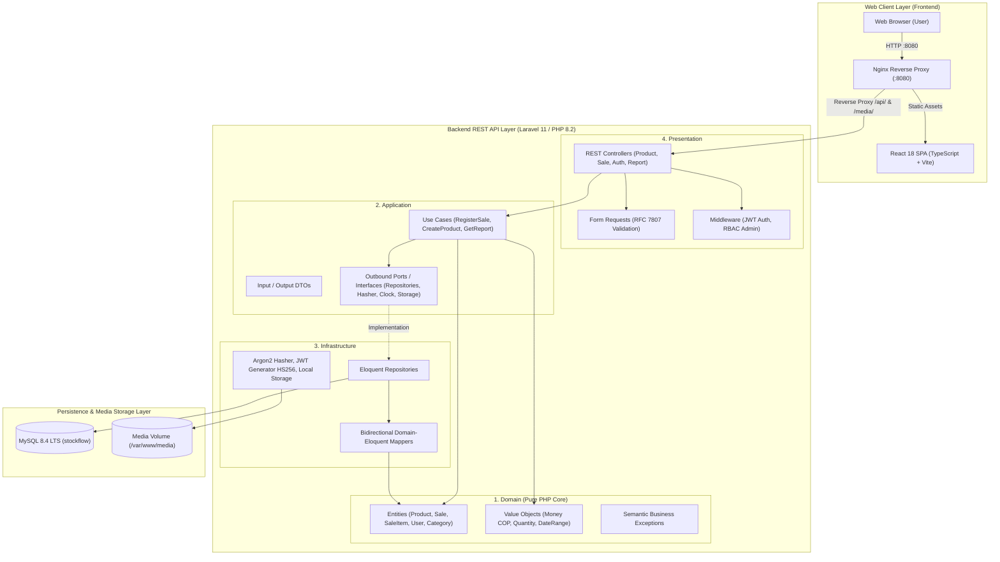
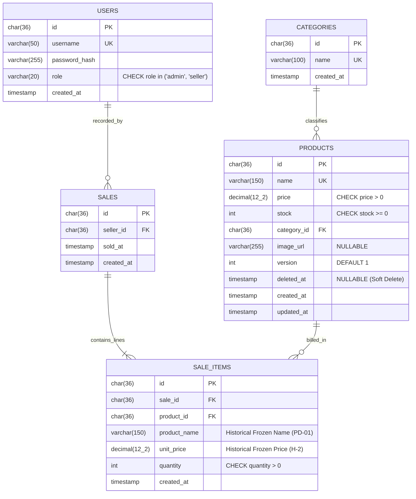
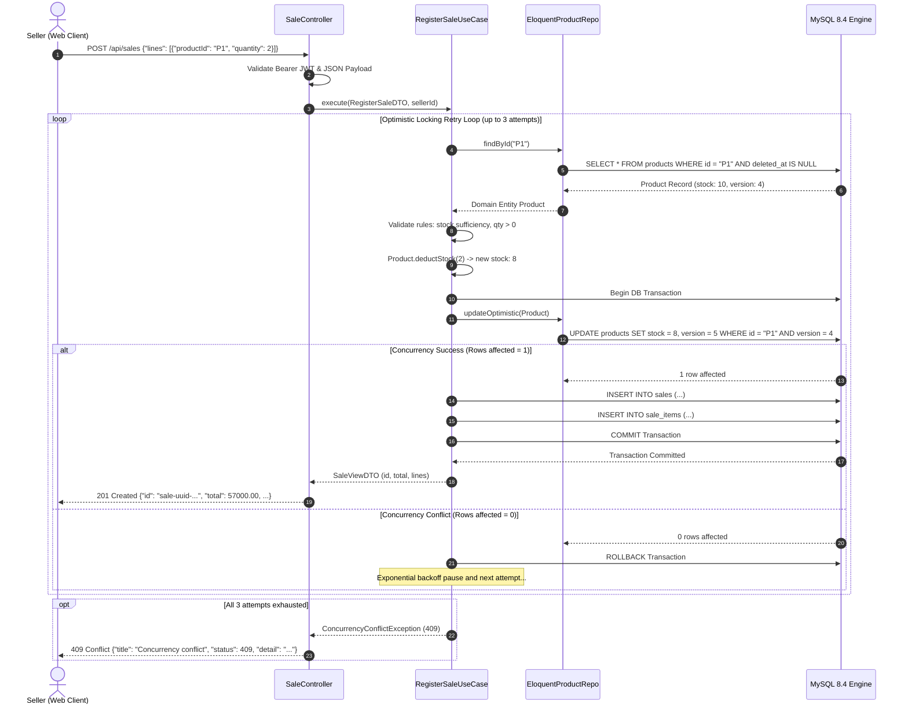

# Simple Stock Flow · Technical Architecture & Delivery Report

> **Spec-Driven Development (SDD) Technical Benchmark**  
> **National Learning Service (SENA) · Software Analysis and Development (ADSO)**  
> **Class:** 3413974  
> **Candidate / Developer:** Kevin (GitHub: [`Kevin81A`](https://github.com/Kevin81A))  
> **Production Stack:** PHP 8.2 (Laravel 11) + React 18 (Vite + TypeScript) + MySQL 8.4 LTS + Docker Compose  

---

## 1. Executive Summary & SDD Methodology

The *Simple Stock Flow* technical benchmark assesses mastery in **Spec-Driven Development (SDD)**: the discipline of taking an exhaustive, unambiguous technical specification (conceptually drafted in Python and .NET), interpreting it objectively without personal bias or framework assumptions, and implementing it flawlessly into an alternate enterprise stack (**PHP with Laravel** for backend services and **React with TypeScript** for frontend interfaces).

### Foundational Principles Observed
1. **The Specification is the Single Source of Truth:** All business rules (BR-01 through BR-11), product decisions (PD-01 through PD-04), currency and date invariants, and OpenAPI / RFC 7807 contracts were strictly honored.
2. **Framework-Free Pure Domain (Onion / Hexagonal Architecture):** The domain layer is authored in pure PHP 8.2 with zero Eloquent or framework coupling.
3. **Strict Relational Persistence:** MySQL 8.4 LTS schema features exactly 25 columns, 21 integrity constraints, 13 indices, and 9 database check constraints (ADR-001).
4. **Unified Monorepo with Multi-Repo Parity:** Delivered both as an all-in-one Monorepo and as synchronized modular repositories for flexible deployment and evaluation.

---

## 2. Architecture & Design Diagrams

### 2.1. System Architecture (Hexagonal / Onion 4-Layer Model)



---

### 2.2. Database Entity-Relationship Model (ERD)



---

### 2.3. Sequence Diagram: Atomic Sale with Optimistic Locking (BR-11)



---

## 3. Requirement Traceability Matrix

| Code | Business Rule / Product Decision | Implementation Source | Verified Behavior |
|---|---|---|---|
| **BR-01** | Product name must be unique and non-empty (max 150 chars). | `app/Domain/Entities/Product.php` & `CreateProductRequest.php` | Form Request validation (400) and UNIQUE DB constraint. |
| **BR-02** | Product price greater than zero, in COP with 2 decimal places. | `app/Domain/ValueObjects/Money.php` | `ROUND_HALF_UP` rounding, invariant `price > 0`. |
| **BR-03** | Product stock greater than or equal to zero (non-negative int). | `app/Domain/ValueObjects/Quantity.php` | `CHECK stock >= 0` in database; exception if negative. |
| **BR-04** | Product must belong to an existing valid category. | `app/Domain/Entities/Category.php` & `EloquentProductRepository.php` | Foreign key `category_id` references `category(id)`. |
| **BR-05** | Optional product image, max 5 MB, JPEG/PNG/WebP. | `app/Presentation/Requests/UploadImageRequest.php` | Strict MIME type validation, saved to `/var/www/media`. |
| **BR-06** | Soft Delete: products linked to sales are never hard-deleted. | `app/Application/UseCases/SoftDeleteProductUseCase.php` | `deleted_at` timestamp; excluded from catalog, kept in history. |
| **BR-07** | Sale cannot be empty; quantity per line item > 0. | `app/Domain/Entities/Sale.php` | `EmptySaleException` and `InvalidQuantityException`. |
| **BR-08** | No duplicate products allowed within the same sale transaction. | `app/Domain/Entities/Sale.php` | `DuplicateSaleProductException` (400) on repeated `productId`. |
| **BR-09** | Atomic stock deduction with pre-validation. | `app/Application/UseCases/RegisterSaleUseCase.php` | `InsufficientStockException` (422) if stock is inadequate. |
| **BR-10** | Derived values (`subtotal`, `total`) calculated dynamically. | `app/Domain/Entities/Sale.php` & `SaleItem.php` | Zero calculated columns in DB tables (Article VII). |
| **BR-11** | Optimistic concurrency control on concurrent sales. | `app/Application/UseCases/RegisterSaleUseCase.php` | Version-based update with 3 retries; HTTP 409 on persistent conflict. |
| **PD-01** | Sales reports must retain the historical frozen product name. | `app/Infrastructure/Persistence/Repositories/DatabaseSalesReportQuery.php` | Window subquery selecting latest frozen name in requested range. |
| **PD-02** | Date ranges use exclusive upper boundary (`to` exclusive). | `app/Domain/ValueObjects/DateRange.php` | SQL condition: `sold_at >= :from AND sold_at < :to`. |
| **PD-03** | Default pagination size of 20 items (max 100). | `app/Application/UseCases/GetProductCatalogUseCase.php` | Standardized `PagedResultDTO`. |
| **PD-04** | Administrators cannot create other administrators. | `app/Application/UseCases/RegisterSellerUseCase.php` | Endpoint `/api/auth/register` strictly enforces `role = 'seller'`. |

---

## 4. Constitution Adherence (13 Articles)

* **Article I (Framework-Free Domain):** `app/Domain/` consists strictly of plain PHP 8.2 classes with zero framework bindings.
* **Article II (Persistence-Agnostic Model):** Entities represent pure business logic without database concerns.
* **Article III (Immutable Value Objects):** `Money`, `Quantity`, and `DateRange` are immutable `readonly` classes.
* **Article IV (Atomic Transactions in Use Cases):** Transactions are orchestrated using `UnitOfWorkInterface` over `DB::transaction()`.
* **Article V & ADR-001 (Schema Ownership):** The database starts empty; API migrations own 100% of schema definitions.
* **Article VI (Thin Controllers):** Controllers handle only HTTP mapping and delegate directly to Use Cases.
* **Article VII (Zero Derived Columns):** Neither `sales` nor `sale_items` store calculated totals.
* **Article VIII (RBAC & JWT Security):** Stateless HS256 tokens with 30s leeway and roles (`admin`, `seller`).
* **Article IX (Zero Default Secrets in Production):** Fails gracefully if `JWT_SIGNING_KEY` or `ADMIN_PASSWORD` are missing.
* **Article X (Edge Validation):** Form Requests enforce schema and emit RFC 7807 `application/problem+json`.
* **Article XI (Language Protocol):** Source code, database entities, and test suites in English; user messages and UI localized in English.
* **Article XII (Idempotent Tooling):** `ssf_tool` executes repeatedly without duplicating records.
* **Article XIII (Five-Question Documentation):** Every repository features a comprehensive README addressing all 5 core questions.

---

## 5. REST API Endpoint Specifications

| Method | Endpoint | Authorization | Response Statuses | Description |
|---|---|---|---|---|
| `GET` | `/health` | Public | `200` | Liveness healthcheck returning `{"status":"ok"}`. |
| `POST` | `/api/auth/login` | Public | `200`, `400`, `401 (empty)` | Authenticates user; returns JWT Bearer token and role. |
| `POST` | `/api/auth/register` | `admin` | `201`, `400`, `401 (empty)`, `403 (empty)` | Creates new seller account (strictly role `seller`). |
| `GET` | `/api/categories` | Authenticated | `200`, `401 (empty)` | Returns list of the 5 fixed seed categories. |
| `GET` | `/api/products` | Authenticated | `200`, `400`, `401 (empty)` | Paginated catalog with keyword search and category filters. |
| `GET` | `/api/products/{id}` | Authenticated | `200`, `401 (empty)`, `404 (empty)` | Retrieves product details by UUID. |
| `POST` | `/api/products` | `admin` | `201`, `400`, `401 (empty)`, `403 (empty)` | Creates a new catalog product. |
| `PUT` | `/api/products/{id}` | `admin` | `200`, `400`, `401 (empty)`, `403 (empty)`, `404 (empty)` | Updates product metadata. |
| `DELETE` | `/api/products/{id}` | `admin` | `204`, `401 (empty)`, `403 (empty)`, `404 (empty)` | Soft-deletes product from active catalog. |
| `POST` | `/api/products/{id}/image`| `admin` | `200`, `400`, `401 (empty)`, `403 (empty)` | Uploads product image file (multipart/form-data). |
| `GET` | `/media/{key}` | Public | `200`, `404 (empty)` | Streams stored product image directly. |
| `POST` | `/api/sales` | Authenticated | `201`, `400`, `401 (empty)`, `409`, `422` | Atomically registers sale and deducts stock. |
| `GET` | `/api/sales` | Authenticated | `200`, `400`, `401 (empty)` | Paginated sales history in date range `from`/`to`. |
| `GET` | `/api/sales/{id}` | Authenticated | `200`, `401 (empty)`, `404 (empty)` | Complete receipt voucher with frozen historical prices. |
| `GET` | `/api/reports/sales` | Authenticated | `200`, `400`, `401 (empty)` | Aggregated sales metrics and breakdown by product. |

---

## 6. Deployment & Evaluation Manual

### 6.1. Running with Docker Compose (One-Step Launch)
```bash
# 1. Clone the unified monorepo
git clone https://github.com/Kevin81A/test-simple-stock-flow.git
cd test-simple-stock-flow

# 2. Build and start containers in the background
docker compose up -d --build

# 3. Check health status
docker compose ps
```

### 6.2. Executing Automated Verification Probes
* **On Linux / macOS / Git Bash:**
  ```bash
  ./verify.sh
  ```
* **On Windows (PowerShell):**
  ```powershell
  .\verify.ps1
  ```

### 6.3. Seeding Sample Demo Data (Optional)
```bash
cd tool
docker build -t ssf-tool .
docker run --rm --network host ssf-tool seed
```

### 6.4. Access Endpoints
- **Web Application (SPA):** [http://localhost:8080](http://localhost:8080)
- **REST API:** [http://localhost:8000](http://localhost:8000)
- **Healthcheck:** [http://localhost:8000/health](http://localhost:8000/health)
- **Default Admin Credentials:** `admin@stockflow.com` (or `admin`) / `Admin12345!`