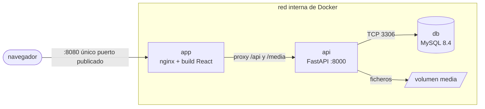
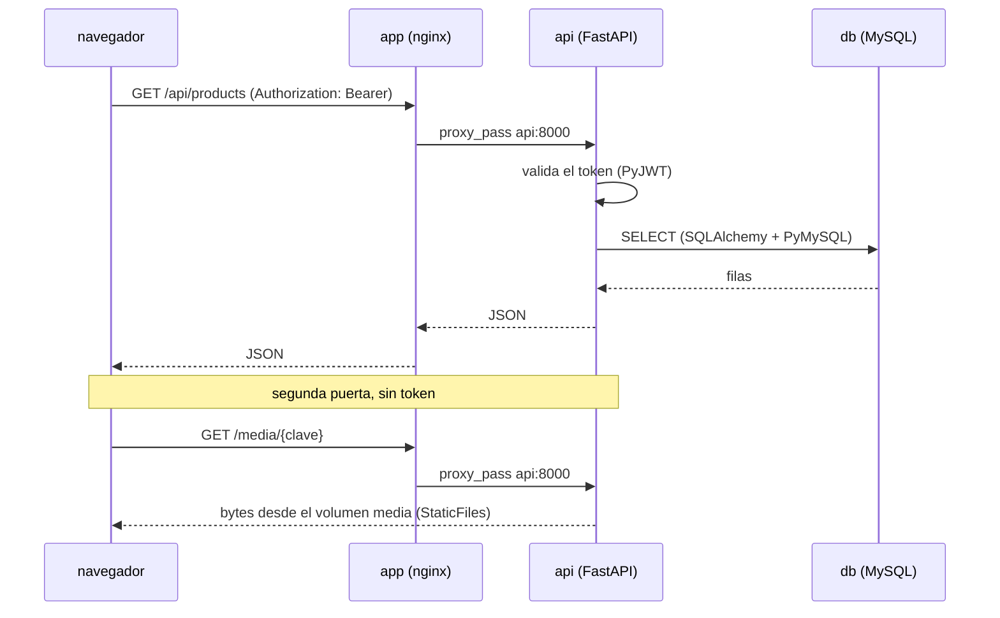
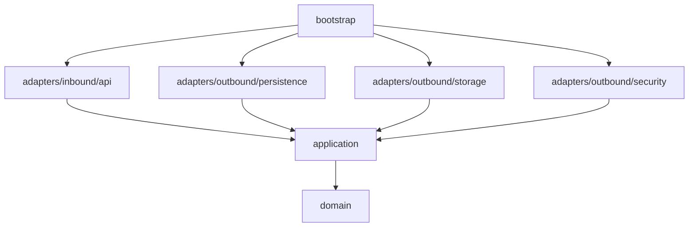
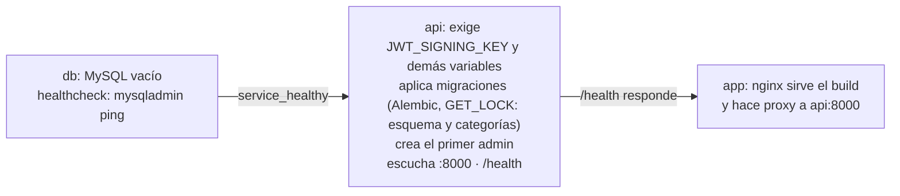

# Arquitectura, vista panorámica

**Qué habla con qué, por dónde y con qué permiso.** Un solo documento para tener el conjunto en la
cabeza antes de abrir cualquier otro.

- **Fecha:** 2026-10-02
- **Alcance:** la forma del sistema y la comunicación entre `simple-stock-flow-infra`,
  `simple-stock-flow-api` y `simple-stock-flow-app`, y el lugar de los otros tres repositorios.
- **De dónde sale cada dibujo:** de la topología prevista del `docker-compose.yml` (servicios `db`,
  `api`, `app`), del `nginx.conf` de la app, de las reglas de `import-linter` de la API y de su
  secuencia de arranque. Cuando el código exista, los dibujos se verifican contra esos archivos.

**Lo que este documento no trae, a propósito:**

| No está aquí | Está en |
|---|---|
| El estado del sistema —qué está hecho y qué no— | la tabla de progreso de [`tasks.md`](tasks.md), y **solo** ahí |
| La forma exacta de cada petición y cada respuesta | [`api-contract.md`](api-contract.md) |
| El porqué de cada decisión estructural | [`adr`](adr) |
| El detalle de capas, puertos, flujos y riesgos | [`architecture.md`](architecture.md) |

> Aquí está **la forma**, que cambia despacio. Si este documento contradice a `architecture.md`,
> gana `architecture.md`.

---

## 1. Tres unidades y una sola puerta



*Figura 1 — En producción se publica **un** puerto. Todo lo demás vive dentro de la red de Docker.*

El navegador nunca habla con la API ni con la base: habla con nginx, y nginx reenvía. Eso no es
cosmética de despliegue —es lo que permite que la API no tenga que estar expuesta para que el
sistema funcione—, y es también la razón de que el servicio `api` no se pueda renombrar libremente:
el `nginx.conf` de la app reenvía a ese nombre de host (`api:8000`).

**El reparto de responsabilidades es la decisión estructural del conjunto** ([ADR-001](adr/adr-001-propiedad-del-esquema.md)):

- **`simple-stock-flow-infra`** levanta el conjunto —red, volúmenes, variables de entorno— y entrega un
  motor **vacío**. Ni una línea de DDL.
- **`simple-stock-flow-api`** trae las reglas de negocio, la API **y el esquema entero** en sus
  migraciones.
- **`simple-stock-flow-app`** no almacena nada. Solo habla con la API.

**El override de desarrollo abre más puertas**, y por eso existe: `docker-compose.dev.yml` (perfil
dev) publica la API en `:8000` y la base en `:3306`. Sin ellas, ni `verify.sh` puede comprobar la API
directamente, ni el sembrador de `simple-stock-flow-tool` puede sembrar, ni el servidor de desarrollo
de Vite tiene con quién hablar. El sembrado entra **por HTTP y nunca por SQL**: los datos de
demostración obedecen exactamente las mismas reglas que lo que teclea una persona.

> Mezclar los dos arranques recrea el contenedor de la API y le quita el puerto publicado sin
> avisar. Si `:8000` deja de responder de golpe, es eso — se explica en el README de infra.

---

## 2. El árbol de trabajo

Antes de mirar dentro de ningún repositorio conviene saber cómo está armado el conjunto en disco,
porque la disposición **forma parte del contrato de despliegue** y no es una preferencia de orden.

```
<raíz del espacio de trabajo>/
├─ simple-stock-flow-infra/    se despliega · docker-compose.yml, .env.example, verify.sh
├─ simple-stock-flow-api/      se despliega · Python 3.12, FastAPI, Alembic
├─ simple-stock-flow-app/      se despliega · React + Vite, nginx.conf
├─ simple-stock-flow-docs/     no · enunciado/, spec/, diagramas/
├─ simple-stock-flow-tool/     no · sembrador de demostración (python -m ssf_tool seed) e imágenes
└─ simple-stock-flow-page/     no · sitio público estático; ningún repositorio depende de él
```

*Figura 2 — Los seis directorios hermanos, su papel y si entran en el compose.*

**Tienen que ser hermanos:** el compose construye las imágenes desde `../simple-stock-flow-api` y
`../simple-stock-flow-app`. Clonar uno de los dos por separado, o anidarlo, deja la construcción sin
contexto.

**Solo tres de los seis se despliegan.** `infra`, `api` y `app` levantan el sistema. `docs` guarda la
especificación y los entregables (incluido `enunciado/prueba-inventarios.docx`), `tool` guarda el
sembrador y las imágenes de demostración, y `page` es la página pública del producto. Ninguno de esos
tres entra en el compose ni hace falta para que el sistema arranque.

**`tool` es un repositorio aparte a propósito.** La promesa de `infra` es que basta con Docker —ni
Python, ni Node, ni un cliente de base de datos—, y el sembrador exige Python. Mantenerlo fuera deja
esa promesa intacta. Convertir los hermanos en submódulos de `infra` queda como mejora futura
opcional (T-17).

Estructura interna prevista de los dos repositorios de código:

```
simple-stock-flow-api/src/stockflow/        simple-stock-flow-app/src/
├─ domain/                                  ├─ domain/
├─ application/                             ├─ application/
│  ├─ ports/{inbound,outbound}/             │  ├─ ports/ · use-cases/ · state/
│  └─ services/                             ├─ infrastructure/
├─ adapters/                                │  └─ http/ · mappers/ · interceptors/
│  ├─ inbound/api/                          └─ features/
│  └─ outbound/{persistence,storage,security}/
└─ bootstrap/composition/port_bindings.py
```

*Figura 3 — Lo que habrá dentro de cada uno.*

Los dos repositorios de código tienen **la misma silueta** —`domain/`, `application/`,
`infrastructure/` o `adapters/`—, y esa coincidencia es el asunto de la §4.

---

## 3. Qué cruza cada frontera



*Figura 4 — Una petición del catálogo, de la pantalla al motor y de vuelta. Debajo, la segunda
puerta: la imagen del producto, que viaja sin token.*

| Tramo | Cómo viaja | Quién autoriza | Qué lleva |
|---|---|---|---|
| Navegador → `app` | HTTP por el único puerto publicado (`APP_PORT`, 8080 por omisión) | nadie: es el estático | el build de React, y después cada llamada |
| `app` → `api` | `proxy_pass` a `api:8000` dentro de la red, con `/api` y `/media` | la API, con el token que le llega tal cual | JSON |
| `api` → `db` | TCP 3306, SQLAlchemy con PyMySQL | `DATABASE_URL` del `.env` | SQL, con la agregación del reporte hecha **en el motor** |
| `api` → volumen `media` | sistema de ficheros del contenedor (`MEDIA_ROOT`) | — | los bytes de las imágenes |
| anfitrión → `api` | HTTP a `:8000`, **solo** con el override de desarrollo | el mismo token que cualquiera | las sondas de `verify.sh`, que vive en `simple-stock-flow-infra`, y el sembrado de `simple-stock-flow-tool` |

**Tres cosas que la lista de endpoints no enseña:**

- **El token no lo pone cada llamada: lo pone un interceptor.** Si hay sesión, el interceptor de
  `src/infrastructure/interceptors/` añade `Authorization: Bearer` a todo lo que sale. Ningún caso de
  uso de la app sabe que existe una cabecera.
- **`/media/{clave}` no es un endpoint.** Lo sirve `StaticFiles` sobre el volumen de binarios, bajo la
  misma URL que publica `FileStorage`. Al no estar enrutado **no pasa por la autorización**, y no hay
  forma de protegerlo sin cambiar el mecanismo: es lo que hace que la etiqueta `` funcione sin
  cabeceras. **Riesgo aceptado de diseño** con dueño —`H-6` de [`api-contract.md`](api-contract.md)
  §5—, no un descuido.
- **La traducción de errores ocurre en un solo sitio**, un exception handler del adaptador REST. Un
  `try/except` de negocio en una ruta pondría esa traducción en dos.

La API declara además un origen permitido (CORS, el de la app). A través del proxy el navegador no
cambia de origen, así que esa política solo entra en juego si alguien llama a la API desde otra
parte.

---

## 4. La misma forma a los dos lados

```
        app (React)                                  api (Python)
┌──────────────────────────┐              ┌──────────────────────────────┐
│ features/                │              │ adapters/inbound/api/  (REST)│
│ application/ (use-cases) │              │ application/ (services)      │
│ domain/                  │              │ domain/                      │
│ infrastructure/http/ ────┼── HTTP/JSON ─┼─► (puerto entrante)          │
└──────────────────────────┘              │ adapters/outbound/           │
                                          └──────────────────────────────┘
```

*Figura 5 — La app repite el hexágono de la API, y los dos se tocan en un punto y solo en uno: el
HTTP entre el cliente de `infrastructure/http/` y el adaptador REST.*

No es simetría decorativa. Es lo que permite probar la política del carrito sin levantar un
servidor, y probar el registro de una venta sin levantar un navegador.

**En cada repositorio hay exactamente un archivo donde un puerto encuentra su adaptador**, y esa es
la propiedad que hay que vigilar: `src/stockflow/bootstrap/composition/port_bindings.py` en la API,
`src/infrastructure/providers.ts` en la app. Instanciar infraestructura fuera de ahí rompe el
hexágono en silencio; cambiar el backend por dobles, en cambio, es cambiar un mapa de dependencias.

---

## 5. La regla de dependencia



*Figura 6 — Cada flecha es una importación permitida. De `domain` no sale ninguna hacia dentro del
proyecto, y `domain` solo importa la biblioteca estándar.*

Esto es lo que hace del hexágono algo comprobable y no un dibujo: **la regla la impone una
herramienta**. `import-linter` declara los contratos de capas y falla si un adaptador importa a otro
o si `application` importa un adaptador; un test de arquitectura recorre los `import` de
`src/stockflow/domain/` y falla si hay algo fuera de la stdlib. Se verifica con `pytest` y con
`lint-imports`, no confiando en la disciplina de nadie.

Los tres niveles de prueba caen solos de esa forma: el dominio se prueba **sin un solo doble**
—no hay nada que fingir—, la aplicación con fakes de sus puertos salientes, y los adaptadores
contra un MySQL real levantado por Testcontainers (exige Docker).

---

## 6. El arranque, que es donde el orden importa



*Figura 7 — Cada paso espera al healthcheck del anterior: a que el proceso **responda**, no a que su
contenedor exista.*

Un orden de arranque a secas solo garantiza que el contenedor exista, y esa es la causa más común de
un primer arranque que falla y un segundo que funciona. Aquí las tres puertas están encadenadas por
condición, no por orden, y la API además **reintenta** la conexión a la base.

Dos detalles del paso del medio valen por sí solos:

- **Sin `JWT_SIGNING_KEY`, la API se niega a arrancar**, y dice por qué. No hay valor por omisión:
  firmar con una clave de relleno arrancaría bien y repartiría tokens falsificables, y el fallo
  aparecería lejos de su causa. Lo mismo vale para `DATABASE_URL`, `ADMIN_EMAIL`, `ADMIN_PASSWORD` y
  `MEDIA_ROOT`.
- **El esquema y las categorías de referencia los pone la migración**, no un script del contenedor.
  Un script de inicialización de MySQL solo se ejecuta con el volumen vacío: la segunda versión del
  esquema no se aplicaría jamás, y el fallo sería silencioso. Como el DDL de MySQL no es
  transaccional, las migraciones son pequeñas y el arranque se serializa con `GET_LOCK`.

---

## 7. Qué debe seguir siendo cierto

Esta vista se revisa contra el código cuando exista. Si alguna de estas afirmaciones deja de
cumplirse, se corrige el documento o el código (artículo X), nunca se deja la discrepancia:

- Los puertos entrantes son cinco y los salientes diez ([`architecture.md`](architecture.md) §3.2),
  incluido `SalesReportQuery`, el puerto de lectura que da al reporte filas ya agregadas por el motor
  ([ADR-004](adr/adr-004-reporte-agregado-y-congelado.md)).
- El único puerto publicado en producción es el 8080 de `app`.
- Un solo archivo de composición por repositorio de código.
- `domain/` importa solo la biblioteca estándar.
